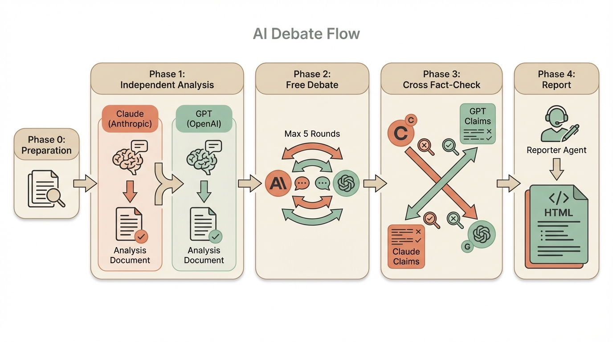

# claude-skill-debate

[](https://www.npmjs.com/package/claude-skill-debate)
[](https://github.com/YunseobShin/claude-skill-debate/blob/master/LICENSE)

A [Claude Code](https://docs.anthropic.com/en/docs/claude-code) skill that orchestrates **multi-turn debates between Claude (Anthropic) and GPT (OpenAI)**, with cross fact-checking and automatic HTML verdict report generation.

<p align="center">
  
</p>

## Install

```bash
npx claude-skill-debate
```

That's it. The skill file is copied to `~/.claude/skills/debate/SKILL.md` and ready to use.

## Prerequisites

| Requirement | Required | Notes |
|---|---|---|
| [Claude Code](https://docs.anthropic.com/en/docs/claude-code) | Yes | CLI installed and authenticated |
| [OpenAI Codex CLI](https://github.com/openai/codex) | Yes | `npm i -g @openai/codex` |
| Codex MCP Server | No (recommended) | Enables multi-turn threading |

### Codex CLI Auth

```bash
# Option 1: ChatGPT Plus / Pro Plan login
codex auth login

# Option 2: API key (usage-based billing)
export OPENAI_API_KEY="sk-..."
```

### Codex MCP Server (Optional)

Add to `~/.claude/settings.json` for richer multi-turn debates:

```json
{
  "mcpServers": {
    "codex": {
      "command": "codex",
      "args": ["--full-auto", "mcp"]
    }
  }
}
```

Without MCP, the skill automatically falls back to CLI mode (full context included in each round's prompt).

## Usage

In Claude Code, type `/debate` followed by any topic:

```
/debate Will AI replace software engineers?
/debate React vs Vue for new projects in 2026
/debate Tesla stock price outlook
/debate Should medical AI regulation be relaxed?
```

Natural language also works:

```
"Have two AIs debate this topic"
"Ask Claude and GPT about this"
```

## How It Works

```
Phase 0  Preparation
         Topic → Extract 3-5 key arguments → Generate debate rules

Phase 1  Independent Analysis (parallel)
         Claude sub-agent ──┐
                            ├──→ 500-800 word analysis each
         Codex (MCP/CLI) ───┘

Phase 2  Free Debate (up to 5 rounds)
         ┌─ Round 1: Claude opens → Codex rebuts
         ├─ Round 2: Codex opens  → Claude rebuts
         ├─ ...
         └─ Convergence check: early exit if no new arguments

Phase 3  Cross Fact-Check
         Claude → verifies top 3 GPT claims
         Codex  → verifies top 3 Claude claims

Phase 4  Verdict Report
         Separate Reporter agent reads full transcript
         → generates HTML report with Tailwind CSS + dark mode

Phase 5  Done
         Auto-opens report in browser + prints summary
```

## Output

All debate artifacts are saved to `/tmp/debate/YYYYMMDD_HHMMSS/`:

| File | Description |
|---|---|
| `topic.md` | Topic & key arguments |
| `rules.md` | Debate rules |
| `analysis_claude.md` | Claude's independent analysis |
| `analysis_codex.md` | GPT's independent analysis |
| `round_N_claude.md` | Claude's round N statement |
| `round_N_codex.md` | GPT's round N statement |
| `factcheck_by_claude.md` | Claude's fact-check of GPT |
| `factcheck_by_codex.md` | GPT's fact-check of Claude |
| `report.html` | Final HTML verdict report |

### HTML Report Sections

1. Header (topic, date, participants)
2. Background
3. Key issues (card layout)
4. Debate highlights (per-round quotes)
5. Fact-check results table
6. **Final verdict** (clear winner, no "both sides have a point")
7. Conclusion & takeaways
8. Disclaimer

## Design Principles

- **No false balance**: the report must pick a winner based on evidence strength
- **Cross-verification**: both sides fact-check the opponent's top 3 claims
- **Early termination**: debate stops when arguments start repeating
- **Parallel execution**: independent phases run concurrently for speed

## Timing

- Typically 3-5 minutes depending on number of rounds
- MCP mode is slightly faster than CLI fallback

## Notes

- Debate logs are in `/tmp` and will be lost on reboot. Copy them if needed.
- Investment/stock debates are for reference only, not financial advice.
- Codex CLI works with ChatGPT Plus or Pro Plan auth; API key usage is billed separately.

## License

MIT

## Related

- [Claude Code](https://docs.anthropic.com/en/docs/claude-code)
- [OpenAI Codex CLI](https://github.com/openai/codex)
- [Claude Code Skills](https://docs.anthropic.com/en/docs/claude-code/skills)
